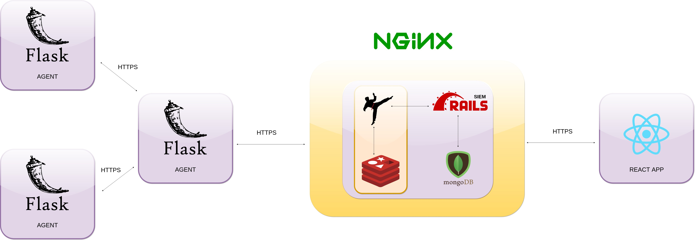

 

 - Install ruby, ruby-bundler, mongodb, yarn, redis
 - gem install rails, foreman (add gems directory to path)

 Run this in project directory:

    > bundle install --path vendor/bundle
    > cd client
    > yarn --ignore-engines

Run this in /certs directory:

    > openssl genrsa -out root_ca.key 2048
    > openssl req -x509 -new -nodes -key root_ca.key -sha256 -days 1024 -out root_ca.crt
    > openssl genrsa -out siem.key 2048
    > openssl req -new -key siem.key -out siem.csr
    > openssl x509 -req -in siem.csr -CA root_ca.crt -CAkey root_ca.key -CAcreateserial -out siem.crt -days 1024 -sha256
    > openssl genrsa -out client.key 2048
    > openssl req -new -key client.key -out client.csr
    > openssl x509 -req -in client.csr -CA root_ca.crt -CAkey root_ca.key -CAcreateserial -out client.crt -days 1024 -sha256
    > curl -v -s -k --key client.key --cert client.crt --cacert root_ca.crt https://{ siem_ip }/logs -- 401 response if passes
    > cat client.key client.crt > client.pem

 - RUN REDIS
    > redis-server

 - RUN SIDEKIQ
    > be sidekiq -q default -q mailers -q notify_agents

 - RUN SERVER API (gibanica directory):
    > be rails s

 - RUN FRONTEND (gibanica/client/ directory):
 	> yarn start

 Configure MongoDB user:

    > use admin
    switched to db admin
    > db.createUser({user: "gibanica", pwd: "123", roles: ["userAdminAnyDatabase", "dbAdminAnyDatabase", "readWriteAnyDatabase"]})

 Add this line to /etc/mongo.conf:

    auth=true

 Remove or comment 'ilogappend = true' in the same file if any errors appear.

 Restart mongod daemon or system.

 Check if user authentication works by executing this:

    > mongo --port 27017 -u "gibanica" -p "123" --authenticationDatabase "admin"

 Add to ~/.bashrc:

    export GIBANICA_SECRET=gIbanicAs3cr3t
    export MONGO_USERNAME=gibanica
    export MONGO_PASSWORD=123
    export MAIL_USERNAME=your_email@domain.com
    export MAIL_PASSWORD=your_password

 For efficient execution of commands, add these aliases to .bashrc too:

    alias mg='mongo --port 27017 -u "gibanica" -p "123" --authenticationDatabase "admin"'
    alias be='bundle exec'

 Restart terminal or execute 'source ~/.bashrc'

 For every new gem added to Gemfile, this command needs to be run inside project root ('/gibanica'):

    bundle install --path vendor/bundle

 For every new npm package, positionate to '/gibanica/client' and run:

    npm install --save 'package'
